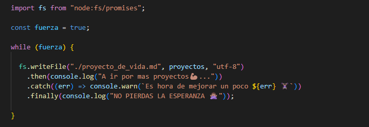

# Hey...!! 👋🏽 soy Davinson vanegas.

## otro más de sistemas 👨🏽‍💻 apasionado por el mundo de la programación y la tecnología... 💻
## 🚀 Sobre mi
> me destaco por mis ganas insaciables de aprender cada día más e ir aprendiendo de mis errores.📚
ya que son situaciones de mejora que me haran mejor programador y persona.🤦🏽‍♂️ 

> mi interés principal se basa en JS,y constantemente estoy explorando nuevas librerias y framework 📓 aplicandolos mis proyectos para asi tener un conocimineto solido 🏋🏽‍♀️ aun asi cabe decir que estoy reciproco a las nuevas tecnologías y  metodologías.🧮
ya que el conocimiento nunca está de más Y gusta estar en constante crecimineto mental y personal.

> Actualmente estoy perfeccionando conocimientos en TS | NODE.JS | EXPRESS | SQL | ASTRO | TAILWIND, pero cabe recalcar que estoy adquiriendo conocimiento continuamente ya que nunca paramos de aprender lenguajes, tecnologías o metodologías para trabajar, 🪐 como lo es en este caso DART | FLUTTER para el desarrollo mobile. 

## 🔗 Links

 
## 🛠 Skills

